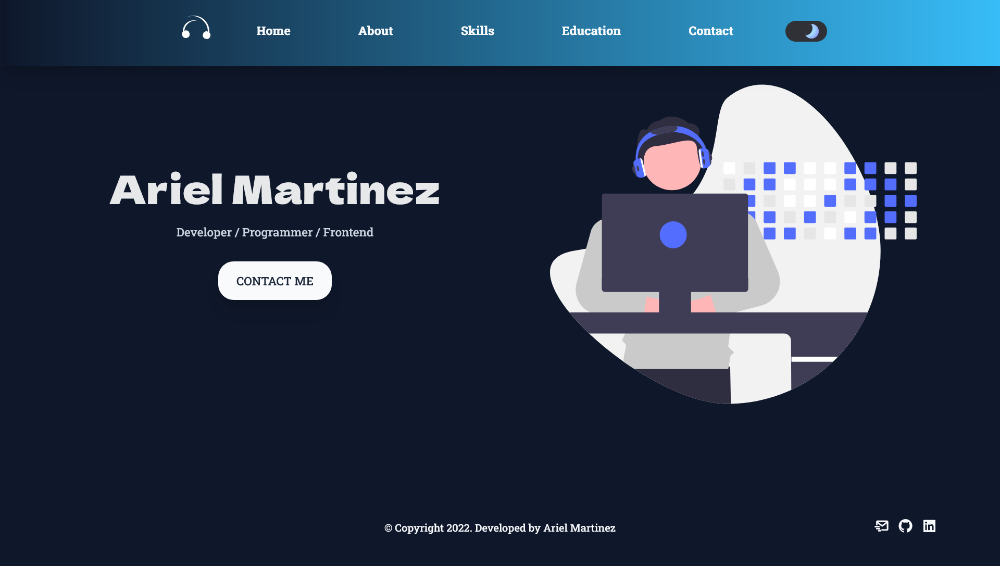

# My Portfolio by Ariel Martinez

This portfolio is made with Nuxt, tailwind and Css for the styles. The page data is directly linked to a JSON file ( static/api/data.json ). Dynamic components. Dark mode is available. Responsive design.



## Resources: 

* [Google fonts](https://fonts.google.com/) 

* [Boxicons](https://boxicons.com/)

* [Animated.css](https://animate.style/)

* [Universe.io](https://universe.io/)

* [unDraw](https://undraw.co/illustrations)


## Run the project
```bash
# clone the repository
$ git clon https://github.com/Arielstereo/My_Portfolio.git

# go to folder
$ cd My_Portfolio

# install dependencies
$ yarn install

# serve with hot reload at localhost:3000
$ yarn dev

```


For detailed explanation on how things work, check out the documentation: 

* [Nuxt](https://nuxtjs.org)

* [Tailwind](https://tailwindcss.com)

